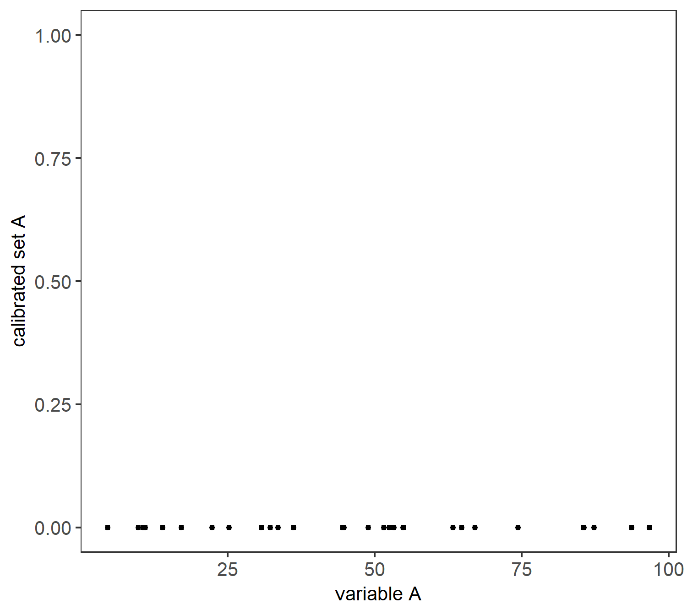
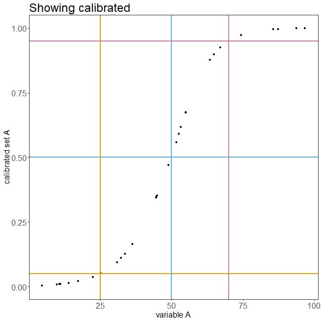

# QCA calibration animations
Animated plots illustrating fuzzy-set calibration in Qualitative Comparative Analysis

## Direct calibration of fuzzy sets
Direct calibration of fuzzy sets is useful when the base variable is continous. I use a hypothetical variable `A` here for illustrating some elements of direct calibration. 

The variables are calibrated into fuzzy-set membership values using the default setting of a logistic link function. In the plot, the vertical lines reflect the inclusion degree membership for 

* members of `A` (top, purple line), 
* the cross-over point (middle, blue line),
* full non-members (bottom, orange line). 

Each vertical line crosses a horizontal line of the same color (intersections with lines of a different color don't matter). The horizontal lines are anchored at the variable values used for calibrating the variable:

* full membership: 70; 
* cross-over point: 50; 
* full non-membership: 25

