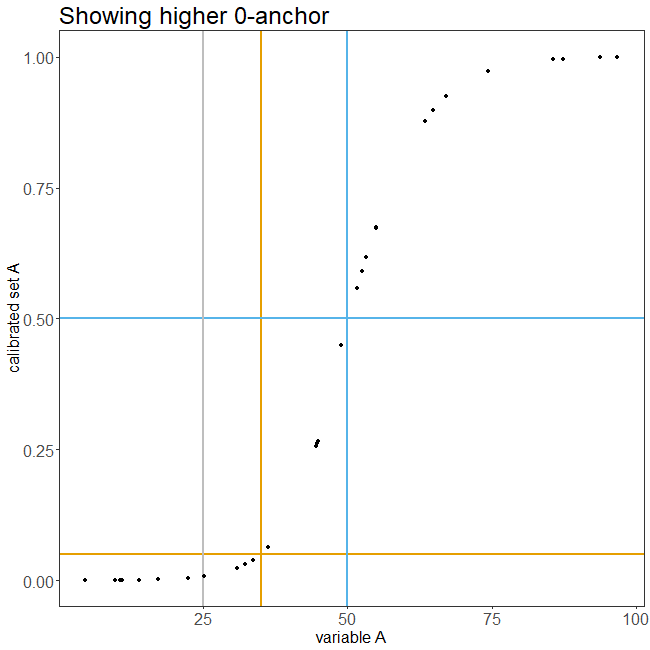

# QCA calibration animations
Animated plots illustrating fuzzy-set calibration in Qualitative Comparative Analysis.

The code for producing the plots in this file is [included in this repository](http://github.com/ingorohlfing/qca-calibration-animations/blob/master/calibration_animation.R).

## Direct calibration of fuzzy sets
### Calibration with default settings
Direct calibration of fuzzy sets is useful when the base variable is continuous. I use a hypothetical variable `A` here for illustrating some elements of direct calibration. 

The variables are calibrated into fuzzy-set membership values using the default settings of the `calibrate()` function of the `QCA` package. They correspond to how Ragin introduces direct calibration in chapters 4 and 5 in his 2008 book. In the plot, the horizontal lines represent the three membership values and, thus, classes of cases. 

* top, purple line: full membership / inclusion (0.95 for calibration reasons, see `idm` option in `calibrate()` function); 
* middle, blue line: cross-over point at (0.5)
* bottom, orange line: full non-membership / exclusion (0.05 for calibration reasons). 

Each horizontal line crosses a vertical line of the same color (intersections with lines of a different color don't matter). The vertical lines are anchored at the hypothetical variable values used for calibrating the variable:

* full membership: 70; 
* cross-over point: 50; 
* full non-membership: 25

The shape of the curve shows that direct calibration translates variable values into set membership values using a logistic link function.

### Recalibrating anchors
What happens when one decides to fix a given anchor at a higher or lower level than the original value? The intuition might be that moving one anchor changes the set membership values of all cases. However, this is not always correct. 

The next plot shows that the recalibration of the upper anchor only affects the membership values of the members of `A`, but not of the non-members (for convenience, I use `A` for the variable and the set). The cross-over anchor shields the non-members from a recalibrated upper anchor. This implication of shifting the upper anchor directly follows from how direct calibration works, which is described in detail in chapters 4 and 5 of Ragin's 2008 book.

The gray line in this and the next two plots marks the originally chosen anchor.

The reverse then holds when one recalibrates the lower anchor. Now the cross-over anchor shields the members of `A` from a recalibrated lower anchor.

This implies that the membership values of all cases are affected when one moves the shield, that is the cross-over anchor is recalibrated.

### Packages used for this analysis
-   base (R Core Team 2018)
-   dplyr (Wickham et al. 2019)
-   gganimate (Pedersen and Robinson 2019)
-   ggplot2 (Wickham 2016)
-   grateful (Rodriguez-Sanchez 2018)
-   QCA (Dusa 2019)
-   tibble (Müller and Wickham 2019)
-   tidyr (Wickham and Henry 2018)

Dusa, Adrian. 2019. *QCA with R. a Comprehensive Resource*. Cham,
Switzerland: Springer International Publishing.

Müller, Kirill, and Hadley Wickham. 2019. *Tibble: Simple Data Frames*.
<https://CRAN.R-project.org/package=tibble>.

Pedersen, Thomas Lin, and David Robinson. 2019. *Gganimate: A Grammar of
Animated Graphics*. <https://CRAN.R-project.org/package=gganimate>.

R Core Team. 2018. *R: A Language and Environment for Statistical
Computing*. Vienna, Austria: R Foundation for Statistical Computing.
<https://www.R-project.org/>.

Rodriguez-Sanchez, Francisco. 2018. *Grateful: Facilitate Citation of R
Packages*. <https://github.com/Pakillo/grateful>.

Wickham, Hadley. 2016. *Ggplot2: Elegant Graphics for Data Analysis*.
Springer-Verlag New York. <http://ggplot2.org>.

Wickham, Hadley, and Lionel Henry. 2018. *Tidyr: Easily Tidy Data with
’Spread()’ and ’Gather()’ Functions*.
<https://CRAN.R-project.org/package=tidyr>.

Wickham, Hadley, Romain François, Lionel Henry, and Kirill Müller. 2019.
*Dplyr: A Grammar of Data Manipulation*.
<https://CRAN.R-project.org/package=dplyr>.
